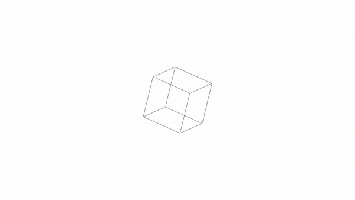

# Examples


# Docomentation
## General defentions
Now, lets take a look at the structure which we define each object:
 - Angle: [rotationX, rotationY, rotationZ] - All rotation angles are in radians
 - Offset: [x, y, z] - The offset between the middle of the scene and an object. If used to define an object, then offset from the original object.
 - Scale: Length of each unit.

## Config
 - ### **Defining points**
You can define points in the following structure:
```json
{
    "points": {
        "p1": [1, 1, 1],
        "p2": [-1, 1, 1],
        "p3": [-1, -1, 1],
        "p4": [1, -1, 1],

        "p5": [1, 1, -1],
        "p6": [-1, 1, -1],
        "p7": [-1, -1, -1],
        "p8": [1, -1, -1]
    }
}
```
 - ### **Defining lines**
You can define lines in the following structure (point name connects to point value): 
```json
{
    "lines": [
        {"p1": "p2"},
        {"p2": "p3"},
        {"p3": "p4"},
        {"p4": "p1"},
        {"p5": "p6"},
        {"p6": "p7"},
        {"p7": "p8"},
        {"p8": "p5"},
        {"p1": "p5"},
        {"p2": "p6"},
        {"p3": "p7"},
        {"p4": "p8"}
    ]
}
```
 - ### **Using objects to create other objects:**
You can create objects using other object config files that you have made.
Small sidenote, the rotation and the scale is proportional to original shape.
```json
{
    "objects": [
        {
            "objectPath": "objects/square.json",
            "offset": [0, 0, 0],
            "angle": [0, 0, 0],
            "scale": 100
        }
    ]
}
```
 - ### **example config**
A config file should like like the example(cube config) below:
```json
{
    "points": {
        "p1": [1, 1, 1],
        "p2": [-1, 1, 1],
        "p3": [-1, -1, 1],
        "p4": [1, -1, 1],

        "p5": [1, 1, -1],
        "p6": [-1, 1, -1],
        "p7": [-1, -1, -1],
        "p8": [1, -1, -1]
    },
    "lines": [
        {"p1": "p2"},
        {"p2": "p3"},
        {"p3": "p4"},
        {"p4": "p1"},
        {"p5": "p6"},
        {"p6": "p7"},
        {"p7": "p8"},
        {"p8": "p5"},
        {"p1": "p5"},
        {"p2": "p6"},
        {"p3": "p7"},
        {"p4": "p8"}
    ],
    "objects": [
    ]
}
```